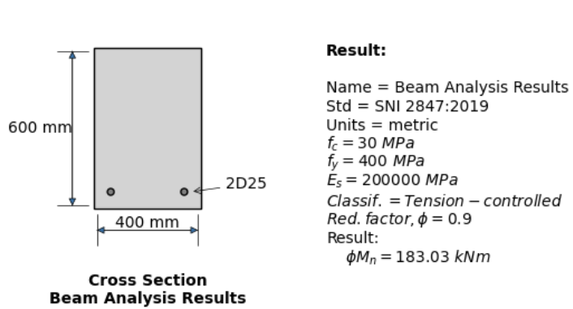
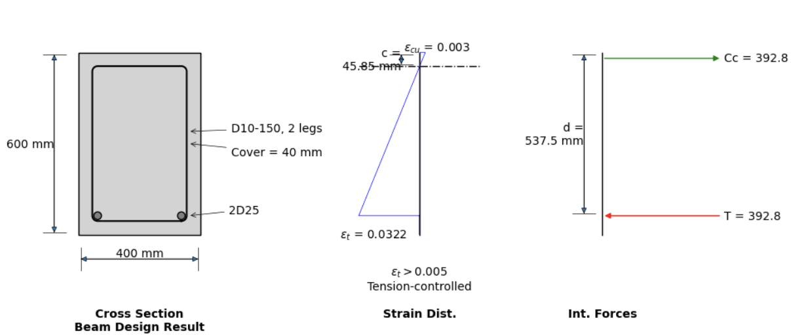
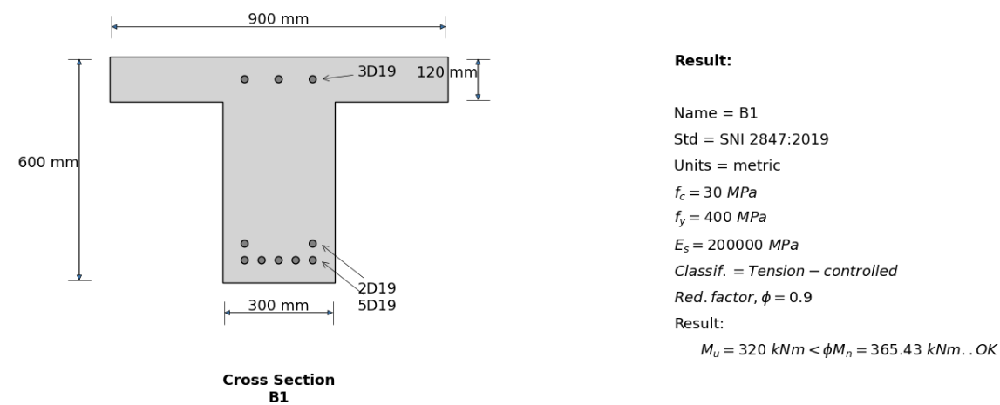

# balokBeton
Analysis and design reinforced concrete beam

## Instalation
PyPI release
```
pip install balokBeton
```

## Includes
* Rectangular singly reinforced beam
* Rectangular doubly reinforced beam
* Flanged singly reinforced beam
* Flanged doubly reinforced beam

Please see Example for more details.

## Example
### 01. Analysis of rectangular singly reinforced beam
```Python
import balokBeton.Balok as bk
import balokBeton.Sketch as sk

b = bk.Rect(name="Beam Analysis Results")
b.material(fc=30,fy=400)
b.dimension(bw=400, h=600, ds=40.5)
b.rebar(rebar = [["D25",2]], Dv="D10")
b.run()

sk.Draw(b).plot()
sk.Draw(b_mid).plot(size=(10,10),font=10,stirrups=True,diagram=True)
```



### 02. Design of flanged doubly reinforced beam
```Python
import balokBeton.Balok as bk
import balokBeton.Sketch as sk

b = bk.DoublyFlanged()
b.material()
b.dimension(bw=300,h=600,be=900,hf=120)
b.design(Mu=320,D="D19",Dc="D19")

sk.Draw(b).plot()
```

